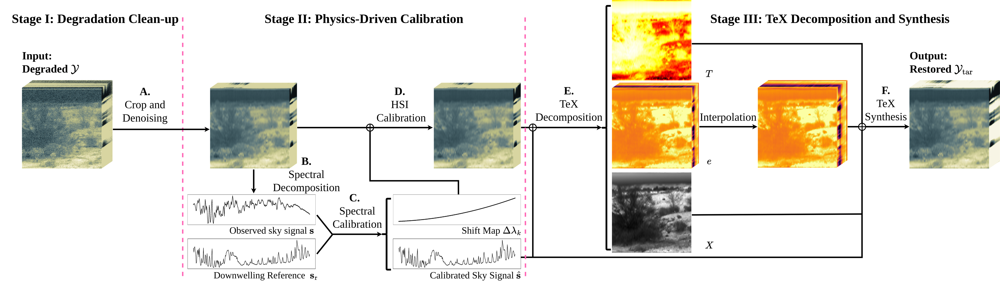

# HAIR: HADAR-Based Thermal Infrared Hyperspectral Image Restoration

This repository contains the public code release for **HAIR** (**HADAR-based Image Restoration**), a physics-driven restoration framework for ground-based thermal-infrared hyperspectral images (TIR-HSI).

HAIR targets TIR-HSI degradations such as stripe artifacts, Gaussian noise, invalid spectral bands, wavelength shifts, and spectral undersampling.
The public code provides the open components around data loading, noisy-band detection, destriping, subspace/BM3D denoising, sky-spectrum extraction, spectral calibration utilities, and interactive visualization.

**Paper:** [HADAR-Based Thermal Infrared Hyperspectral Image Restoration](https://arxiv.org/pdf/2605.13664)

**Authors:** Cheng Dai*, Jiale Lin*, Bingxuan Song, Yifei Chen, Jiashuo Chen, Xin Yuan, and Fanglin Bao

`*` Equal contribution. Corresponding author: Fanglin Bao.



HAIR restores degraded TIR-HSI by combining sensor-aware restoration with a HADAR-based TeX physical representation. The framework models temperature, emissivity, and texture jointly, so denoising, inpainting, spectral calibration, and spectral super-resolution can be evaluated not only by radiance fidelity, but also by physical consistency.


The example above summarizes the spectral calibration and restoration behavior under severe band degradation. HAIR uses an atmospheric downwelling reference to estimate wavelength shifts, recover corrupted spectral regions, and stabilize the downstream TeX decomposition.

## Important Patent Notice

The core HADAR TeX inversion module is **not included** in this public release
because it is subject to patent and intellectual-property restrictions. In
particular, the public repository intentionally keeps the following functions as
interfaces/placeholders:

- `get_config()` in [`hadar_module_v2.py`](./hadar_module_v2.py)
- `hadar_solver_v2(...)` in [`hadar_module_v2.py`](./hadar_module_v2.py)

As a result, this repository does **not** reproduce the complete end-to-end
HADAR restoration results from the paper by itself. The released code is meant
to document and run the non-proprietary preprocessing, restoration utilities,
calibration scaffold, and visualization workflow around the protected HADAR
solver interface.

## Repository Layout

```text
.
├── figures/                    # README figures copied from the paper
├── main.ipynb                  # Example HAIR workflow notebook
├── hair_module.py              # Restoration and spectral calibration utilities
├── hadar_module_v2.py          # Data loading, plotting, sky processing, LUT helpers
├── highres_ref_sky.txt         # High-resolution atmospheric sky reference
├── pyproject.toml              # Python project and dependency specification
└── uv.lock                     # Locked dependency versions
```

## Environment Setup

This project is configured with [`uv`](https://docs.astral.sh/uv/) and requires
Python 3.12 or newer.

### 1. Clone the repository

```bash
git clone https://github.com/jialelin2007/HAIR.git
cd HAIR
```

### 2. Create the environment

```bash
uv sync
```

The locked environment includes the main dependencies used by the released
modules:

- `jax[cuda12]`
- `numpy`
- `scipy`
- `matplotlib`
- `plotly`
- `spectral`
- `bm3d`
- `joblib`
- `emd-signal`
- `ipykernel`

The default dependency file pins CUDA-enabled JAX (`jax[cuda12]==0.6.2`). If you
want to run on a CPU-only machine, replace `jax[cuda12]==0.6.2` in
[`pyproject.toml`](./pyproject.toml) with the matching CPU JAX package for your
platform, then refresh the environment.

## Basic Usage

The example notebook is organized as a staged pipeline:

1. Load a TIR-HSI cube from ENVI-style files (`.hdr` with `.bsq`, `.sc`, or
  `.dat`) using `load_data(...)`.
2. Detect noisy or corrupted spectral bands with `detect_noisy_bands(...)`.
3. Apply the released destriping and denoising utilities.
4. Extract a sky spectrum and align it to the high-resolution atmospheric
  reference in [`highres_ref_sky.txt`](./highres_ref_sky.txt).
5. Call the HADAR solver interface.
6. Visualize temperature, emissivity, brightness, and spectra.

Before running the notebook, update:

```python
file_input_folder = "./data"
file_name = "Input file name here"
```

to point to your own HSI data. The repository does not include the full
experimental datasets used in the paper.

## Public Modules

### `hair_module.py`

This file contains the released restoration and spectral calibration utilities:

- `detect_noisy_bands(...)`: row/stripe-based noisy-band detection
- `destripe(...)`: JAX-based ADMM destriping routine
- `denoise(...)`: subspace denoising with BM3D filtering
- `correct_band(...)`: downwelling-reference guided wavelength calibration
- `interpolate_emmisivity_vmap(...)`: emissivity interpolation helper
- `lookup_B_vector_batch(...)`: Planck-LUT lookup helper

### `hadar_module_v2.py`

This file contains released data and visualization helpers:

- `load_data(...)`: ENVI-style HSI loading for `.bsq`, `.sc`, and `.dat`
- `wavenumber_to_wavelength(...)`: wavenumber-to-wavelength conversion
- `process_sky_spectrum(...)`: sky-spectrum extraction by ALS, EMD, or direct mode
- `generate_planck_lut(...)`: Planck radiance and derivative lookup tables
- `plot_hsi(...)`, `plot_T_map(...)`, `plot_e_map(...)`, `plot_bright_map(...)`:
interactive visualization utilities

The protected HADAR-specific functions are intentionally left as placeholders.

## Data Notes

- `highres_ref_sky.txt` is a two-column high-resolution atmospheric reference
spectrum used by the calibration utility.
- The outdoor pushbroom-camera experiments in the paper use the TIR subset of
the DARPA Invisible Headlights / HEADLIGHTS dataset. Dataset information is
available from Kitware: <https://www.kitware.com/darpa-headlights-dataset/>.
- The full experimental datasets used in the paper are not redistributed in this
repository.

## Citation

If you use this code or build on HAIR, please cite:

```bibtex
@article{dai2026hair,
  title   = {HADAR-Based Thermal Infrared Hyperspectral Image Restoration},
  author  = {Dai, Cheng and Lin, Jiale and Song, Bingxuan and Chen, Yifei and Chen, Jiashuo and Yuan, Xin and Bao, Fanglin},
  journal = {arXiv preprint arXiv:2605.13664},
  year    = {2026},
  url     = {https://arxiv.org/pdf/2605.13664}
}
```

For the pushbroom-camera dataset used in the outdoor experiments, please also
refer to the DARPA Invisible Headlights / HEADLIGHTS dataset page:
<https://www.kitware.com/darpa-headlights-dataset/>.

## Update

We will continue to announce related releases as the project progresses. In particular, please follow our future work on an open TeX-Vision dataset of thousands of real-world TIR-HSI images with their TeX triplet labels, constructed using the denoising and restoration pipeline introduced in HAIR, as well as a possible release of the core HADAR inversion code.

## License

The released code in this repository is licensed under the
PolyForm Noncommercial License 1.0.0. See [`LICENSE`](./LICENSE) for details.

The PolyForm Noncommercial License 1.0.0 applies only to the materials
released in this repository. The core HADAR TeX inversion module is not
included in this public release due to patent and intellectual-property
restrictions, and this license does not cover unreleased HADAR inversion
implementations, separately released datasets, trademarks, or third-party
materials.
